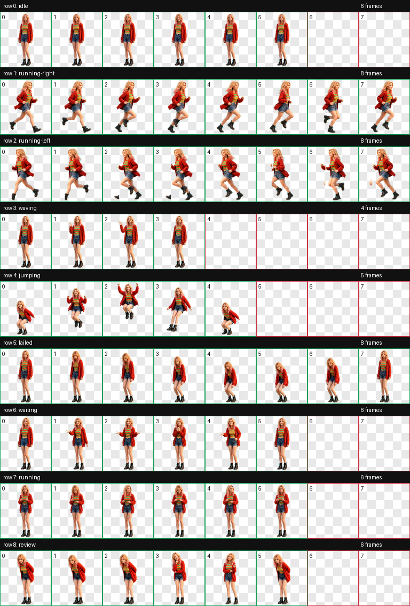

# Codex 宠物：格温

一个可安装到 Codex 桌面应用的高清 3D 格温风格甜妹宠物包。仓库同时保留成品宠物、动作预览、主要参考图和生成提示词，方便换电脑后直接恢复或继续迭代。



## 换电脑后安装

在 Windows PowerShell 中执行：

```powershell
git clone https://github.com/Muachaochao/codex-pet-gwen.git
cd codex-pet-gwen
powershell -ExecutionPolicy Bypass -File .\scripts\install.ps1
```

安装脚本只会把 `package\codex-gwen` 中的清单和精灵图复制到当前 Windows 用户的 `.codex\pets\codex-gwen` 目录，并在完成后校验精灵图的 SHA-256。

安装完成后：

1. 打开 Codex 的“设置 > 宠物”。
2. 点击右上角的刷新按钮。
3. 找到“Codex 格温”并点击“选择”。
4. 点击“唤醒宠物”，也可以在 Codex 中使用 `/pet`。

如果刷新后仍未显示，关闭并重新打开 Codex，再回到宠物页面刷新。

## 卸载

在仓库根目录执行：

```powershell
powershell -ExecutionPolicy Bypass -File .\scripts\uninstall.ps1
```

卸载脚本会先验证目标目录确实是 `.codex\pets` 下的 `codex-gwen`，然后只移除这个宠物目录。

## 动作与画布规格

- 精灵图：`1536 × 1872` WebP，透明背景。
- 网格：`8 × 9`，共 72 个固定槽位。
- 单格：`192 × 208`。
- 九行动作：待机、向右跑、向左跑、挥手、跳跃、失败、等待、工作、审阅。
- 每行有效帧数依次为：6、8、8、4、5、8、6、6、6；剩余槽位用于补齐固定网格。

## 仓库结构

```text
package/codex-gwen/       可直接安装的宠物包
preview/                  动作总览图
source/references/        角色和动作参考图
source/prompts/           生成基础角色与各行动作的提示词
scripts/install.ps1       Windows 一键安装
scripts/uninstall.ps1     Windows 安全卸载
```

## API 与素材说明

安装和使用这个本地宠物包不需要任何 API 密钥，也不要把密钥、令牌或 `.env` 文件提交到仓库。

本项目是个人制作的非官方 Codex 宠物，与 OpenAI 或其他角色版权方没有隶属或背书关系。仓库包含个人定制的私有参考素材和衍生视觉资产，建议保持仓库为私有；未经相应权利人许可，请勿公开发布、商业使用或再次分发。
